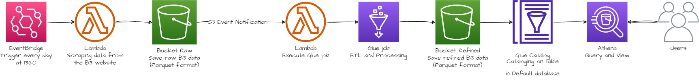
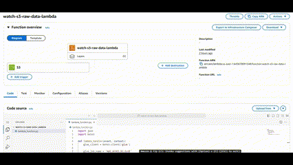
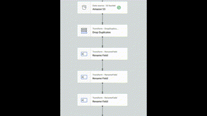

# FIAP TECH CHALLENGE | Pipeline Batch Bovespa

## Challenge:

Build a complete data pipeline to extract, process and
analyze data from the B3 trading floor, using AWS S3, Glue, Lambda and Athena. The
mandatory link to download the source data is [here](https://sistemaswebb3-listados.b3.com.br/indexPage/day/IBOV).

## GIF with the solution

## Flowchart solution

## Lambda

## Glue Job

## Contribution

We welcome contributions to this project! Here’s how you can help:

1. Fork the repository.
2. Create a new branch (`git checkout -b feature/YourFeatureName`).
3. Make your changes and commit them (`git commit -m 'feat: Add some feature'`).
4. Push to the branch (`git push origin feature/YourFeatureName`).
5. Open a Pull Request.

Please ensure that your code adheres to the project's coding standards and includes appropriate tests where necessary.

## License

This project is licensed under the MIT License - see the [LICENSE](LICENSE.txt) file for details.

## Contact

For questions, suggestions, or feedback, please contact:

* **Edson Vitor**  
  GitHub: [barravitor](https://github.com/barravitor)